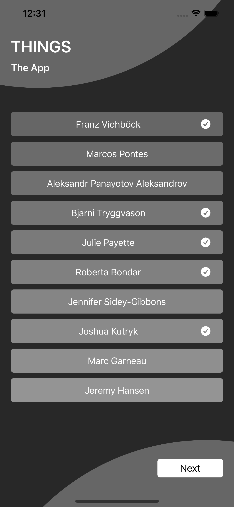
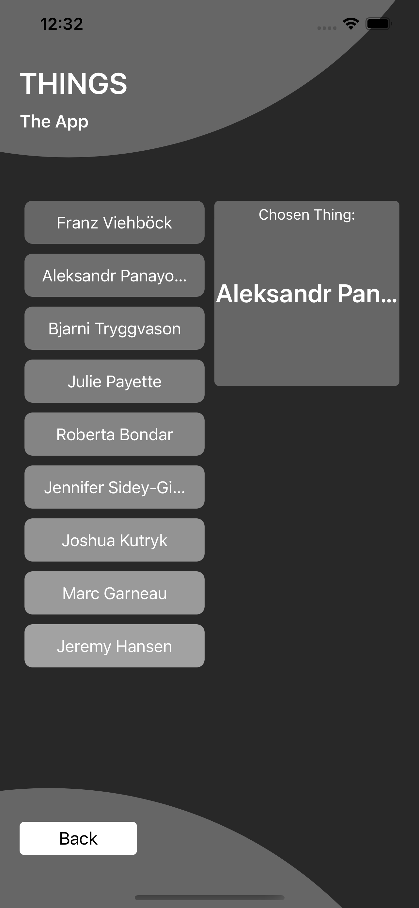

# MVVM + Restful API + No Storyboard + No Third-Party Library

## Get Started

This project is written by **Swift 5** and requires **Xcode 13+**.

1. Open the **Things.xcodeproj** in Xcode 13+
1. Build and run

## Screenshots

## Thanks for Review!